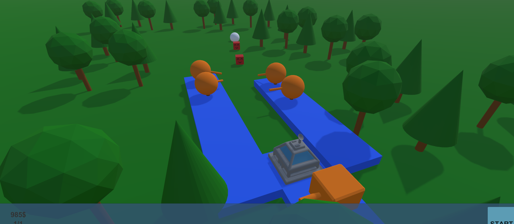

# Unity3D-TowerDefence-Template
 A tower defence game template with a modular wave system.

### Features
- Simple game flow (start,win,lose,restart)
- Modular wave system
- Automated pathfinding
- Primitive upgrade system

# Table of Contents
1. [Setup](#Setup)
2. [Adding Levels](#Adding-Levels)
3. [Adding Enemies](#Adding-Enemies)
4. [Adding Turrets](#Adding-Turrets)

## Setup
Unity3D 2019.4.4f1 was used to create this project.

## Adding-Levels
Open the scene at /Assets/Scenes/TestLevel/ and then save it as a new scene in a new folder in the Asset/Scenes/[Make new folder here]/ directory and use it as a fresh slate.

## Adding-Enemies
Drag the prefab /Assets/Resources/Enemies/BoxSoldier into the scene and then drag it into the /Assets/Resources/Enemies/ folder as an original prefab. Rename it and change the paramaters as you please. To change the visuals open the prefab and ONLY change the Mesh transform of the prefab.

## Adding-Turrets
Drag the prefab /Assets/Resources/Buildables/Turret_Basic into the scene and then drag it into the /Assets/Resources/Buildables/ folder as an original prefab. Rename it and change the paramaters as you please. To change the visuals open the prefab and ONLY change the base, Cylinder, Barrel and turretBox.

## Adding-Waves
When a level is loaded a WAVE SET is loaded into the GameManager. A wave set is a collection of singular WAVES. To create a WAVE SET to go /Assets/Scripts/Systems/WaveSystem/WaveSet/ and then right right click then Create->Waves->WaveSet. To add waves to the waveset go to /Assets/Scripts/Systems/WaveSystem/Waves/ and then right click then Create->Waves->Wave. Inside the wave you have a Wave Clumps list. make it 1 or more. Set the enemy to an enemy prefab (see [Adding Enemies](#Adding-Enemies)). After creating all your waves go back to the WaveSet you created and attach all the waves you want to it (make sure to increase the Waves list size from 0). After that go to your newly made level (see [Adding Levels](#Adding-Levels)) and select the GameManger gameobject and in the WaveManager script attached to that object change the WaveSet to the wave set we have created.

